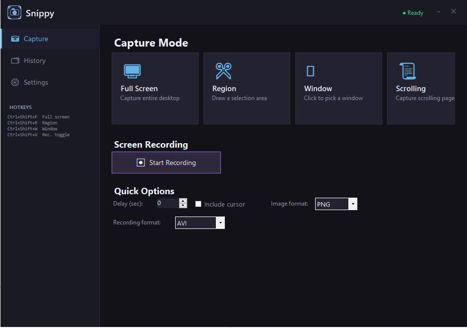
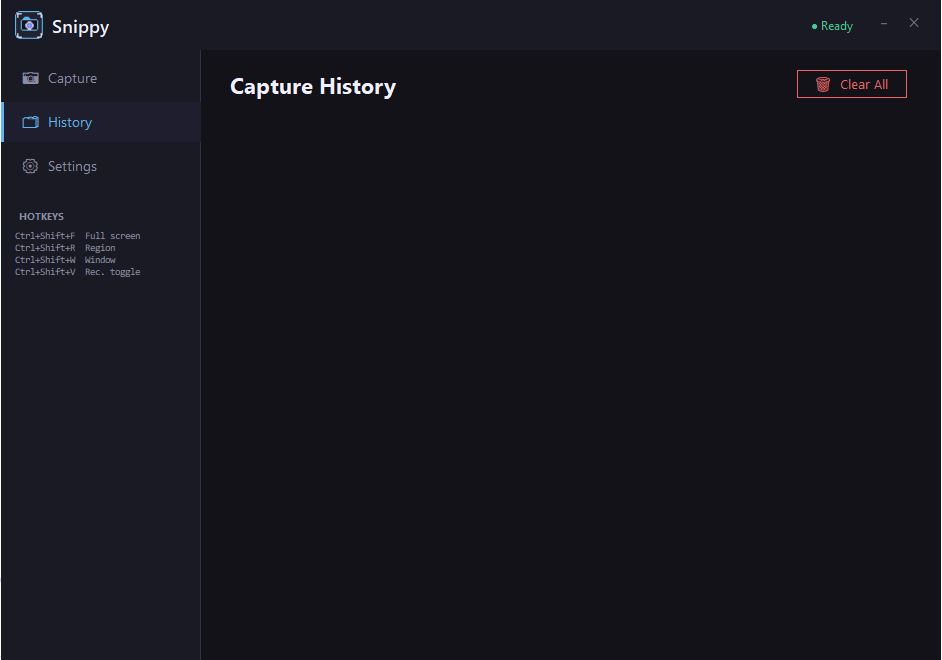
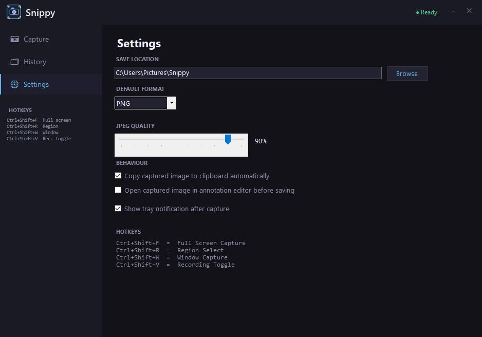

# SnapMaster

A modern, lightweight, portable screen capture and recording tool built with C# WinForms and .NET 8.

SnapMaster provides fast screenshot workflows, scrolling capture, screen recording, annotation tools, and global hotkeys — all packaged into a clean desktop experience that runs as a single portable executable.

---

## Features

### Screen Capture Modes
- Full screen capture
- Region selection capture
- Window capture
- Scrolling capture
- Multi-monitor support

### Annotation Workflow
- Built-in annotation editor
- Draw arrows, rectangles, highlights, and text
- Option to:
  - Automatically copy captures to clipboard
  - Open captures in editor before saving

### Screen Recording
- Record selected screen regions
- Export formats:
  - MP4
  - AVI
  - GIF
- Recording timer
- Live recording outline overlay

### Productivity Features
- Global keyboard shortcuts
- System tray integration
- Portable single-file executable
- Capture history viewer
- Configurable save locations
- Optional cursor capture

---

## Screenshots

### Capture Mode / Video



### History



### Settingsor



Example:

```md


---

# Download

Prebuilt portable releases are available under the GitHub Releases section.

Download the latest:
- Windows x64 portable EXE
- ZIP package

---

# Building From Source

## Requirements

- Visual Studio 2022
- .NET 8 SDK
- Windows 10/11

## Clone

```bash
git clone https://github.com/rpuentes2020/Snippy.git
cd Snippy
```

## Run

```bash
dotnet run
```

## Publish Portable EXE

```bash
dotnet publish -c Release -r win-x64 ^
-p:PublishSingleFile=true ^
-p:SelfContained=true ^
-p:IncludeNativeLibrariesForSelfExtract=true ^
-p:EnableCompressionInSingleFile=true ^
-p:PublishTrimmed=false
```

---

# Recommended Repository Structure

```text
Snippy/
¦
+-- docs/
+-- Snippy/
+-- README.md
+-- LICENSE
+-- NOTICE.md
+-- .gitignore
+-- Snippy.sln
```

---

# Git Ignore

Create a `.gitignore` file in the repository root:

```gitignore
.vs/
bin/
obj/
publish/
*.user
*.suo
*.pdb
```
